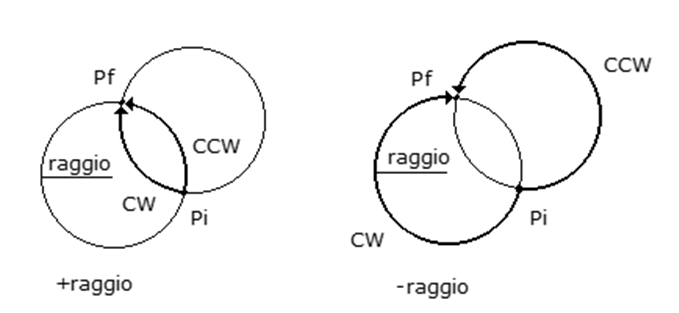

# CIRCABS

## Sintassi

  ```
CIRCABS	[etichetta], asse1, quota1, asse2, quota2, senso, ±raggio [, angolo]
  ```

## Parametri
|Parametro                     | Descrizione                                                                                                                           |                
|------------------------------|---------------------------------------------------------------------------------------------------------------------------------------|
| **etichetta**                | costante o variabile integer. Etichetta che identifica un blocco di spostamento                                                       |
| **asse1...[...asse2]**       | nomi di dispositivi tipo asse                                                                                                         |
| **quota1, quota2**           | costante o variabile double. Rappresenta la quota di spostamento assoluto                                                             |     
| **senso**                    | variabile integer. Specifica il tipo di rotazione. <br/> Sono ammessi i valori:  <br/> -**CW** oraria  <br/> -**CCW** antioraria      | 
| **raggio**                 	 | costante o variabile. Rappresenta il valore del raggio del cerchio                                                                    |     
| **angolo**                 	 | costante o variabile. Rappresenta l'angolo di partenza                                                                                |      


## Descrizione
Esegue un movimento ad arco di cerchio per il canale di interpolazione degli assi **asse1, asse2**. L’arco si estende dal punto finale dell’ultimo comando di movimento al punto indicato con **quota1, quota2** espresso nel sistema di riferimento corrente (si veda l’istruzione [SETCOORDSYSTEM](SETCOORDSYSTEM.md)). Il raggio della circonferenza a cui appartiene l’arco è dato dal parametro **raggio**. Se non è indicato il parametro **angolo**, l’arco da eseguire viene selezionato in base al valore del parametro senso e al segno (positivo o negativo) del parametro **raggio**: un valore positivo indica l’arco più lungo mentre uno negativo l’arco più corto. 

In caso sia indicato il parametro **angolo**, invece, il segno del parametro **raggio** viene ignorato. Il parametro **angolo** individua il centro della circonferenza secondo la convenzione adottata dalla macro CIRCLE. L’uso di questo parametro è obbligatorio qualora si voglia eseguire un arco di cerchio completo, cioè quando le quote finali **quota1, quota2** coincidano con quelle iniziali del movimento. Il parametro opzionale **etichetta** è utilizzato per identificare ciascun movimento inserito in traiettoria. 

È possibile leggere l’**etichetta** assegnata al movimento in esecuzione con la proprietà asse _LabelInterp_.

Per poter utilizzare la macro è necessario prima aver aperto un canale di interpolazione con la macro [OPENINTERP](OPENINTERP.md). 

