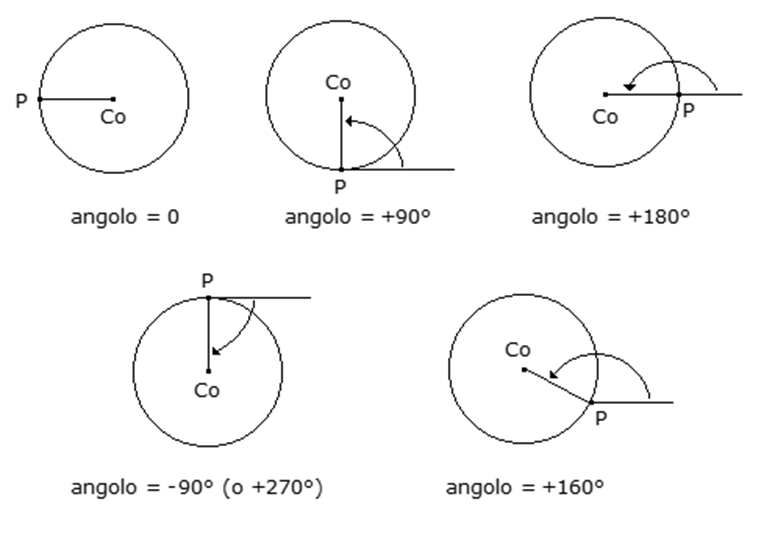

# CIRCLE

## Sintassi

  ```
CIRCLE [etichetta],asse1, asse2, senso, raggio, angolo
CIRCLE [etichetta],asse1, qcentro1, asse2, qcentro2, senso
  ```

## Parametri
|Parametro                     | Descrizione                                                                                                                           |                
|------------------------------|---------------------------------------------------------------------------------------------------------------------------------------|
| **etichetta**                | costante o variabile integer. Etichetta che identifica un blocco di spostamento                                                       |
| **asse1...[...asse2]**       | nomi di dispositivi tipo asse                                                                                                         |
| **qcentro1, qcentro2**       | costanti o variabili double. Centro del cerchio                                                                                       |     
| **senso**                    | variabile integer. Specifica il tipo di rotazione. <br/> Sono ammessi i valori:  <br/> -**CW** oraria  <br/> -**CCW** antioraria      | 
| **raggio**                 	 | costante o variabile. Rappresenta il valore del raggio del cerchio                                                                    |     
| **angolo**                 	 | costante o variabile. Rappresenta l'angolo di partenza                                                                                |      


## Descrizione
Esegue un movimento circolare per il canale di interpolazione degli assi **asse1, asse2**. 

Nel caso sia indicato il parametro **angolo** la posizione del centro della circonferenza viene individuata secondo la seguente convenzione: si prende il versore del sistema di riferimento corrente individuato da **asse1** e lo si ruota nel piano di una quantità pari ad **angolo**: il versore ottenuto indica la retta su cui si trova il centro della circonferenza. 

Il parametro opzionale etichetta è utilizzato per identificare ciascun movimento inserito in traiettoria. 

È possibile leggere l’**etichetta** assegnata al movimento in esecuzione con la proprietà asse _LabelInterp_.

Per poter utilizzare la macro è necessario prima aver aperto un canale di interpolazione con la macro [OPENINTERP](OPENINTERP.md).

