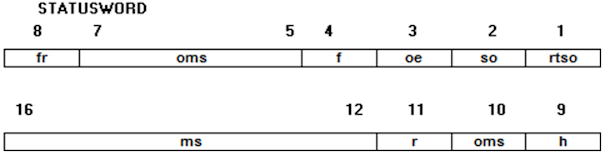
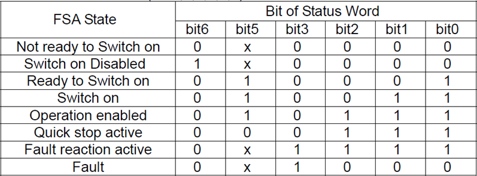
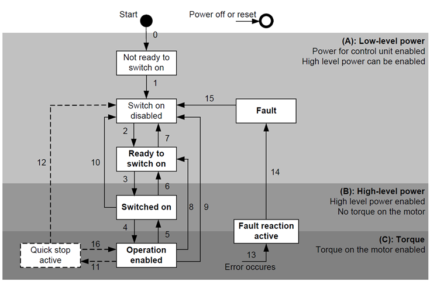

# ECATGETSTATUSWORD

## Sintassi

  ```
ECATGETSTATUSWORD asse, valore
  ```

## Parametri
|Parametro         | Descrizione                       |                
|------------------|-----------------------------------|
| **asse**         | nome di dispositivo tipo asse     |         
| **valore**       | variabile integer.                |

## Descrizione
Restituisce il **valore** contenuto nella StatusWord dell’**asse** richiesto, in modo conforme a _"CiA 402 CANopen device profile"_.

**Tabella definizione dei valori per EtherCAT**



|Bit	| Significato	                       | Nome in virtuale fisico |             
|-----|------------------------------------|-------------------------|
| 1	  | rtso = Ready to switch on	         | RTSO                    |
| 2	  | so = Switched on	                 | SW2                     |
| 3	  | oe = Operation enabled		         | OE                      |
| 4	  | f = Fault	            	           | ALM                     |
| 5	  | ve = Voltage enable	    	         | VE                      |
| 6	  | qs = Quick stop	         	         | QS                      |
| 7	  | sod = Switch on disabled		       | SOD                     |
| 8	  | w = Warning	              	       | WARNG                   |
| 9	  | ms = Manufacturer specific	       | SW9                     |
| 10	| rm = Remote                	       | SW10                    |
| 11	| tr = Target reached or reserved	   | SW11                    |
| 12	| ila = Internal limit active	       | SW12                    |
| 13	| oms = Operation mode specific		   | SW13                    |
| 14	| oms = Operation mode specific		   | SW14                    |  
| 15	| ms = Manufacturer specific		     | SW15                    |
| 16	| ms = Manufacturer specific		     | SW16                    |

Dal valore della StatusWord è possibile ricavare lo stato dell’asse controllando gli opportuni bit:



