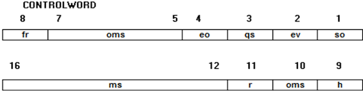
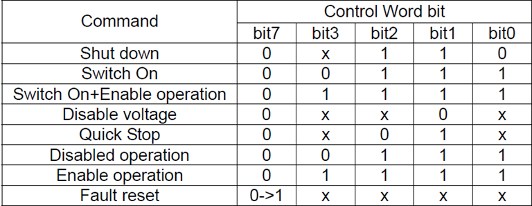

# ECATSETCONTROLWORD

## Sintassi

  ```
ECATSETCONTROLWORD asse, dato [,maschera]
  ```

## Parametri
|Parametro         | Descrizione                                                            |                
|------------------|------------------------------------------------------------------------|
| **asse**         | nome di dispositivo tipo asse                                          |         
| **dato**         | variabile o costante integer. Imposta la ControlWord                   |
| **maschera**     | variabile o costante integer. indica i bit significativi di dato       |

## Descrizione
Imposta il **dato** della ControlWord dell'**asse**, in modo conforme all'operatività attiva, secondo _"CiA 402 CANopen device profile"_.
Se il parametro **maschera** è omesso viene assegnato il valore della ControlWord dal parametro **dato**. Se il parametro **maschera** è presente verranno impostati solo i bit del parametro **dato** che sono ad 1 nel parametro **maschera**.

**Tabella definizione dei valori per EtherCAT**



|Bit	| Significato	                       | Nome in virtuale fisico |             
|-----|------------------------------------|-------------------------|
| 1	  | so = Switch ON	                   | CW1                     |
| 2	  | ev = Enable voltage                | EV                      |
| 3	  | qs = Quick stop		                 | STOP                    |
| 4	  | eo = Enable operation	             | SVON                    |
| 5	  | oms = Operation mode specific    	 | CW5                     |
| 6	  | oms = Operation mode specific      | CW6                     |
| 7	  | oms = Operation mode specific		   | CW7                     |
| 8	  | fr = Fault reset             	     | RESALM                  |
| 9	  | h = Halt                           | CW9                     |
| 10	| oms = Operation mode specific	     | CW10                    |
| 11	| r = Reserved	                     | CW11                    |
| 12	| ms = Manufacturer specific         | CW12                    |
| 13	| ms = Manufacturer specific	       | CW13                    |
| 14	| ms = Manufacturer specific		     | CW14                    |  
| 15	| ms = Manufacturer specific		     | CW15                    |
| 16	| ms = Manufacturer specific		     | CW16                    |

Tramite I valori della ControlWord è possibile pilotare gli stati della macchina stati (FSA) di un asse EtherCAT:




Per pilotare gli stati asse potrebbe essere necessario disabilitare la gestione automatica da parte del firmware del controllo numerico: vedere macro [ECATAXFSAMODE](ECATAXFSAMODE.md).