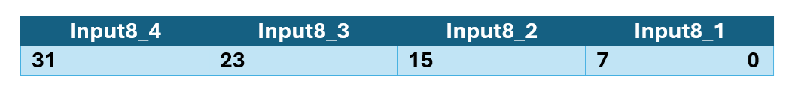

# MULTIINPPORT

## Sintassi

  ```
MULTIINPPORT input8_1[,...,input8_4],variabile
  ```

## Parametri
|Parametro                | Descrizione                                                 |                
|-------------------------|-------------------------------------------------------------|
| **input8_1**            | fornisce i bit da 0 a 7                                     |               
| **input8_2**            | fornisce i bit da 8 a 15                                    |               
| **input8_3**            | fornisce i bit da 16 a 23                                   |               
| **input8_4**            | fornisce i bit da 24 a 31                                   |               
| **variabile**           | variabile integer che riceve il valore degli input8         |

## Descrizione
Legge fino a quattro input8 contemporaneamente e li scrive in una **variabile**. La lettura dei input8 avviene in maniera atomica, questo garantisce che la lettura sia eseguita all’interno dello stesso real-time. 

I'**input8_1** corrisponde al byte più basso, mentre l'**input8_4** a quello più alto.


