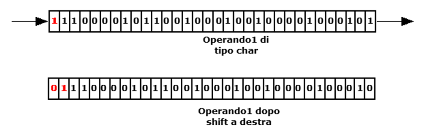

# SHIFTL

## Sintassi

  ```
SHIFTL operando1 [, operando2]
  ```

## Parametri
|Parametro              | Descrizione                                        |                
|-----------------------|----------------------------------------------------|
| **operando1**         | variabile (integer o char o byte) o dispositivo    |   
| **operando2**         | variabile (integer o char o byte) o dispositivo    |         

## Descrizione
Se non è specificato **operando2** esegue una operazione di scorrimento a sinistra dei bit che compongono l'**operando1**. Se è specificato anche il secondo operando, esegue un'operazione di rotazione tra i bit **operando2** e i bit di **operando1**. Al termine dell'operazione **operando2** conterrà il riporto, cioè il bit alto di **operando1**.

### Esempio 1
Rotazione di operandi di tipo integer (shift a sinistra con riporto)
Prima della rotazione


Dopo della rotazione


### Esempio 2
Scorrimento (shift a sinistra senza riporto)

