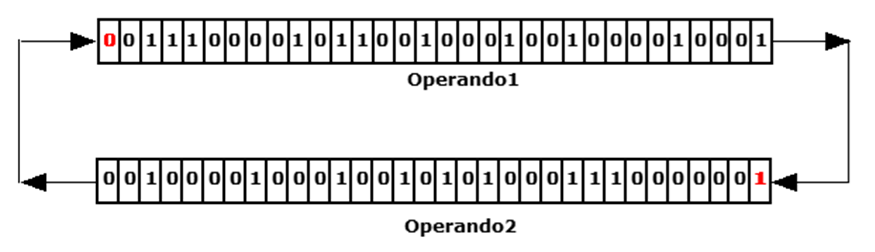

# SHIFTR

## Sintassi

  ```
SHIFTR operando1 [, operando2]
  ```

## Parametri
|Parametro              | Descrizione                                        |                
|-----------------------|----------------------------------------------------|
| **operando1**         | variabile (integer o char o byte) o dispositivo    |   
| **operando2**         | variabile (integer o char o byte) o dispositivo    |         

## Descrizione
Se non è specificato **operando2**, esegue un'operazione di scorrimento a destra dei bit che compongono l'**operando1**. Se **operando1** è dichiarato di tipo char, il bit alto in ingresso è sempre 0. Se **operando1** è dichiarato di tipo integer, il bit 32 in ingresso è il bit di segno. 

Se è specificato anche il secondo operando, esegue un'operazione di rotazione tra **operando2** inteso come valore 0 o diverso da 0 e i bit di **operando1**. Al termine dell'operazione **operando2** conterrà il riporto dell'operazione e il bit di peso più alto di **operando1** diventerà 0 o 1, a seconda del valore iniziale di **operando2** (0 o 1). 

### Esempio 1
Rotazione di operandi di tipo integer (shift a destra con riporto)
Prima della rotazione


Dopo della rotazione


### Esempio 2
Scorrimento a destra di un char (shift a destra senza riporto)


### Esempio 3
Scorrimento a destra di un integer (shift a destra senza riporto)
