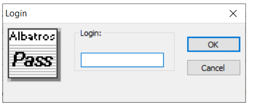

# Access rights to the system

Albatros has four access levels to the system:

* **User**: is the level with most access restrictions. It does not allow to modify any of the device settings. It is the level used for machining and normal machine operations. When the system is booted, this access level is automatically enabled.
  
* **Service**: is the level used for ordinary maintenance of the machine. The operator should be able to modify some configuration parameters, without altering the structure of the machine.
  
* **Manufacturer**: is the level used to configure plants and machines. At this level almost any kind of modification is possible. It is used by developers.
  
* **Tpa**: is the highest access level of the system. Its function is to protect access to particularly delicate settings, whose modification requires a detailed knowledge of Albatros. This level is very rarely used and the access password must be requested directly at TPA.

To access the system at a higher level than User, or to return to User level after introducing changes at a higher level, the corresponding password must be introduced.

To recall the login window, press **Ctrl + *** (asterisk). Alternatively, click on the  icon on the right of the Windows Task bar with the right mouse button to view a menu showing the Change pass level command.

The window you are opening looks like this:

Now enter the password and press the **[OK]** key to confirm. The letters composing the word will be visualized as "*" characters, so that none can read the password typed in.

By typing in the password, you have logged into the corresponding access level. To have a confirmation of the level accessed, select the heading About Albatros from the Help menu.

 
:::danger Attention

If the password entered is not correct, the error message "Warning! Wrong Password!" will appear.

:::

