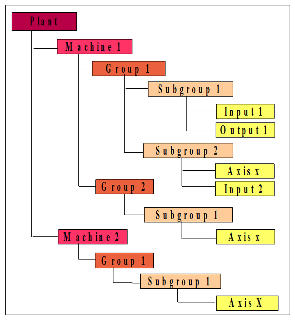

# Organization and logic configuration

In the Albatros system, the descriptive structure of the plant or single tool machine is organised in a technological file with a hierarchical structure.

This approach allows, if necessary, to maintain the modular structure of the machine as far as the configuration data and access modalities are concerned, by classifying it in terms of dynamic association of various modules, aggregates and devices that may be enabled or disabled according to the required setting.

Following this logical structure, in the most general and complex case, the higher hierarchical level will be composed by: 

## Plant
Simply a set of machines. It represents the operational parts managed by the Numerical Control. The plant is always present, even in the case of a single machine and it is not necessary to mention it explicitly.
 

## Machine 
From a "logic" point of view it is defined as a set of devices (axes, timer etc.) and control cycles, corresponding to a GPL language code that applies the control algorithms of the machine itself. Generally the machine is provided with a large number of devices which are organised into groups.
 

## Groups 
Are "containers" which allow to organise the components of the machine following a logical criteria. For example we could define an "axes" group containing all the axes of the machine, the limit switches, the cyclic performing the axis homing etc.
 

## Subgroups
Indicate a further subdivision of a group. For example, the "axes" group could be divided into "digital axes" and "stepper axes".

## Devices
Are the lowest level of the hierarchy. They are a logic representation of the electrical and mechanical components of the machine and are independent of the hardware below.
 
## Example of hierarchical structure of a plant.

 

:::caution Note

The Groups do not necessarily have to be divided into Subgroups, they can be directly made up of Devices.

:::

In the case of a plant with more than one machine, to access given functions, such as Diagnostic, System configuration and Technological Parameters, it is necessary to select the machine whose data you need to view.
