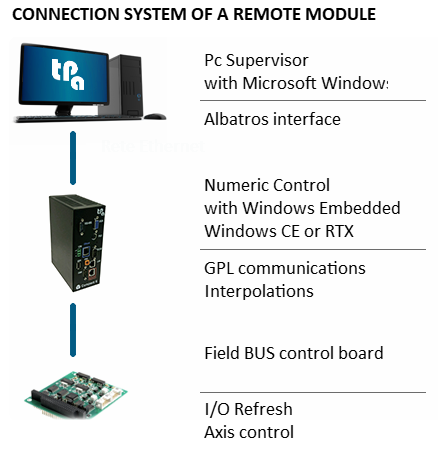

# Typical architecture of the system

Because many aspects of graphical representation and the structure of basic data of the Machine depend greatly on the kind of Machine, this Manual provides by way of example a description of the composition of a typical system, as well as some general information.

The detailed information, the diagrams and the graphics of the real system obviously depend on the specific application, and are consequently prepared by the Manufacturer of the Machine Tool.

The Albatros numerical control system is composed of a supervisor PC, showing the Operator-Machine interface, and a number of Modules (range between 1 and 16) for the piloting and control of all operative resources of the Tool Machine or Plant.

So, you can have two kinds of plants:
- *Monomodule*: consisting of one module connected directly to the PC bus.
  
- *Multimodule*: consisting of a minimum of 1 and a maximum of 16 modules, usually used for applications on Plants or Lines with several machines; the PC unit in this case is physically separated from the Modules, which can be located in different points of the Line or Plant. 

In both architectures, the modules are composed of one or more axis boards for the direct control of the Machine Axes and the logic management of the Input/Output system.

In the monomodule version, the axis boards are installed directly in the Supervisor PC, while in the multimodule version they are installed in an industrial PC (with or without screen and keyboard) connected to the Supervisor PC via Ethernet networl. The following figure shows the diagram of the connection between the Supervisor PC and the remote module (Clipper). The main activities of the single components are also described.

  
Intelligent remote devices pilot I/O devices and axes (TRS-AX remote) directly on the machine. These devices read the Digital Input (ON/ OFF) or Analog Input channels, refresh the Digital or Analog Output channels and are connected to the Modules by means of a GreenBUS (serial bus RS485 - 1 Mbaud), CAN bus, and EtherCAT.

The profile machining of Albatros is protected by a USB hardware key, configured by TPA.
